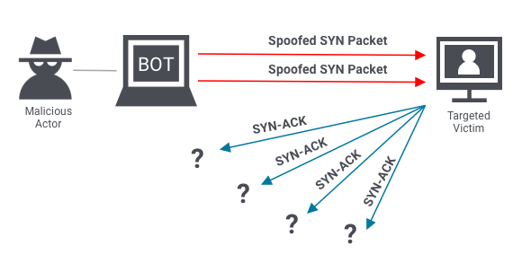
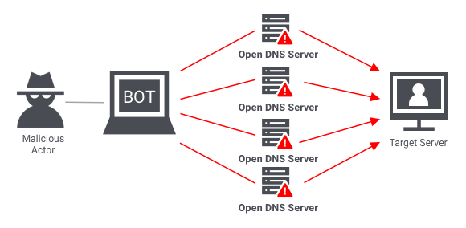

# <b>HULK</b> 
<h2>Http Unbearable Load King 👑</h2> 

  

#
## <b>DDOS Attack Script :</b>
<h3> <b>👽👾<i>Hulk</i></b> - most powerful ddos script based on python  
<strong> ✒️ Author :  Sumalya Chatterjee </strong></h3>

#
## <b>Git Installation :</b>
`sudo apt update && sudo apt upgrade -y` 
`sudo apt install python -y` 
`sudo apt install git -y` 
`python -m pip install -r requirements.txt` 
`python hulk.py` 
#

## <b>Debian Issue Solved :</b>

error: externally-managed-environment

× This environment is externally managed
╰─> To install Python packages system-wide, try apt install
    python3-xyz, where xyz is the package you are trying to
    install.
    
    If you wish to install a non-Debian-packaged Python package,
    create a virtual environment using python3 -m venv path/to/venv.
    Then use path/to/venv/bin/python and path/to/venv/bin/pip. Make
    sure you have python3-full installed.
    
    If you wish to install a non-Debian packaged Python application,
    it may be easiest to use pipx install xyz, which will manage a
    virtual environment for you. Make sure you have pipx installed.
    
    See /usr/share/doc/python3.12/README.venv for more information.

note: If you believe this is a mistake, please contact your Python installation or OS distribution provider. You can override this, at the risk of breaking your Python installation or OS, by passing --break-system-packages.
hint: See PEP 668 for the detailed specification.

 
<h4>If you see this type of error this means you need to install module like this way :--</h4> 

`sudo apt install python3-scapy` 
`sudo apt install python3-django` 
`sudo apt install python3-tkinter` 
#

<h2> <strong>What is DDOS Attack?</strong> </h2>  
<h3> DDoS (Distributed Denial of Service) is a category of malicious cyber-attacks that hackers or cybercriminals employ in order to make an online service, network resource or host machine unavailable to its intended users on the Internet. Targets of DDoS attacks are flooded with thousands or millions of superfluous requests, overwhelming the machine and its supporting resources. DDoS attacks are distinct from conventional Denial of Service incidents in that they originate from distributed or multiple sources or IP addresses. To get a sense of the enormous scope of the DDoS threat, the Check Point ThreatCloud Live Cyber Threat Map provides a global window into malware activity, providing a DDoS attacks map where exploits can be viewed in real time.</h3> 

  

#
<h2> <b>Types Of DDOS Attacks</b> </h2>
<h3> Even though the end goal of a DDoS attack is always to overwhelm the system, the means to achieve the goal can differ. Three broad types of DDoS attacks are as follows.  

<b> 1. Application layer attacks </b>

The application layer is where the server generates the response to an incoming client request. For example, if a user enters http://www.xyz.com/learning/ on their browser, an HTTP request is sent to the server, requesting the learning page. The server will fetch all the information related to the page, package it in a response, and send it back to the browser.

This information fetching and packaging happens on the application layer. An application layer attack occurs when a hacker uses different bots/machines to repeatedly request the same resource from the server, eventually overwhelming it.

The most common type of application layer attacks are the HTTP flood attacks in which malicious actors just keep sending various HTTP requests to a server using different IP addresses. One example of this is asking a server to generate PDF documents over and over again. Since the IP address and other identifiers change in every request, the server can’t detect that it’s being attacked.  
   

<b> 2. Protocol attacks </b>

Protocol attacks look to exhaust resources of a server or those of its networking systems like firewalls, routing engines, or load-balancers. An example of a protocol attack is the SYN flood attack.

Before two computers can initiate a secure communication channel – they must perform a TCP handshake. A TCP handshake is a means for two parties to exchange preliminary information. A SYN packet is typically the first step of the TCP handshake, indicating to the server that the client wants to start a new channel.

In a SYN flood attack, the attacker floods the server with numerous SYN packets, each containing spoofed IP addresses. The server responds to each packet (via SYN-ACKs), requesting the client to complete the handshake. However, the client(s) never respond, and the server keeps waiting. Eventually, it crashes after waiting too   
long for too many responses.  

<b>3. Volumetric attacks</b>

Volumetric attacks are conducted by bombarding a server with so much traffic that its bandwidth gets completely exhausted. The most common example of a volumetric attack is the DNS amplification attack.

In such an attack, a malicious actor sends requests to a DNS server, using the spoofed IP address of the target. The DNS server then sends its response to the target server. When done at scale, the delugeof DNS responses can wreak havoc on the target server.  
  
</h3>

#
<h2> <strong>DDOS Threats</strong> </h3>  
<h3> DDoS incidents are closely associated with botnets, where hackers take over command and control of thousands of Internet-connected devices, and then in coordinated attacks, direct all those devices to simultaneously send requests to the target. In recent years, however, hacktivist groups and crime organizations have increasingly begun using attack tools that are easy to obtain and simple to use. These DDoS attack applications, such as WebHive LOIC, originated as tools for cybersecurity professionals to perform “stresser” testing on websites. In standalone instances, they are not capable of carrying out a serious DDoS attack. However, when multiple stresser applications are coordinated together, whether through a botnet or via cloud service, these attack tools can take large commercial websites offline for extended periods.</h3>  

#
<h2> <strong>DDOS Challenges</strong> </h2>  
<h3> 
   🔴 DDoS attacks can be carried out using a variety of tactics – DNS flood, overwhelming available bandwidth, exploiting cloud resources, etc.  
   🔴 Using methods similar to DDoS, hackers are increasingly carrying out lower-intensity “degradation of service” attacks that inflict costly service slowdowns without taking resources fully offline. In some cases, these attacks can also evade detection by DDoS protection systems for extended periods.  
   🔴 With the proliferation of IoT devices, the number of network entryways from which organizations can be attacked is exploding.  
   🔴 The need is growing for endpoint monitoring tools to immediately and effectively halt flooding at both the network and application layers.  
   🔴 87% of DDoS attack victims are targeted multiple times. Once an organization is identified as vulnerable, hackers do not let up.   
 </h3>

#
<h2> <strong>Why do DDoS Attacks Happen?</strong> </h2>  
<h3>     
   👉 Ransom: Attackers usually demand ransom after conducting DDoS attacks. However, at times, a ransom note threatening an attack can also be sent beforehand.   

   👉 Hacktivism: DDoS attacks are also used to voice opinion. Hacktivists can carry out a DDoS attack to show their support or opposition to a regulation, person, or company.  

   👉 Competition: A 2017 survey revealed that over 40% of companies that were hit by a DDoS attack blame their competition for it.</h3>  

#
<h2> <strong>Prevent DDOS Attack</strong> </h2>  
<h3> 
Stopping an active DDoS attack can be hard and may affect your legitimate users. This is why it’s important to take a preemptive approach. In addition to the preventive measures mentioned below, you should also create an emergency DDoS incident response plan, as even the best defenses can sometimes succumb to sophisticated attacks.  

  💀 Real-time packet analysis: Analyze packets based on different rules, as they enter your system, discarding the potentially malicious ones.  
  💀 DDoS defense system (DDS): A DDS can detect legitimate-looking content with malicious intent. It protects against both protocol and volumetric attacks, without requiring any human intervention.  
  💀 Web application firewall: Web application firewalls (WAF) are a great tool to mitigate application layer DDoS attacks. They give you a way to filter incoming requests, based on different rules, which can also be added on-the-fly, in response to an attack.  
  💀 Rate limiting: Limit the number of requests a server can entertain over a certain time period.  

</h3>

#
